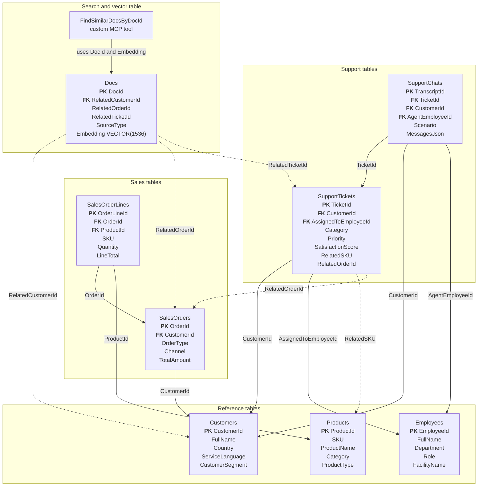
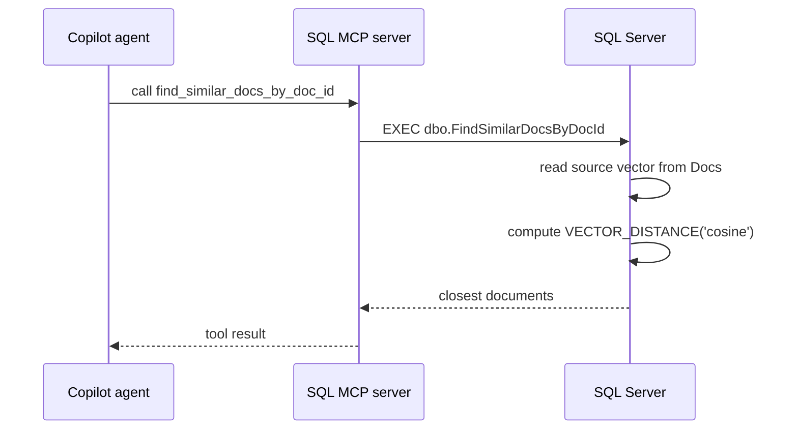

# SQL database guide

This Codespace contains a SQL Server 2025 database named `PromptathonDb`. The database is intentionally small enough for a contest, but it keeps realistic relationships from the Zava business data.

Use this document to understand the schema. Use SQL MCP tools to answer contest questions.

## Data model overview

The database exposes eight table entities and one custom MCP tool:

| Entity | SQL table or procedure | Purpose |
| --- | --- | --- |
| `Products` | `dbo.Products` | Enriched B2C and B2B product catalog. |
| `Customers` | `dbo.Customers` | Registered B2C customers. Guest and in-store buyers appear as null `CustomerId` values on orders. |
| `Employees` | `dbo.Employees` | Employees enriched with facility context. |
| `SalesOrders` | `dbo.SalesOrders` | Unified B2C and B2B sales order headers. |
| `SalesOrderLines` | `dbo.SalesOrderLines` | Unified B2C and B2B line items enriched with product context. |
| `SupportTickets` | `dbo.SupportTickets` | Support ticket headers enriched with customer, client, and employee context. |
| `SupportChats` | `dbo.SupportChats` | One row per LLM-generated support chat transcript. |
| `Docs` | `dbo.Docs` | Searchable documents built from reviews and support chats, with vector embeddings. |
| `find_similar_docs_by_doc_id` | `dbo.FindSimilarDocsByDocId` | Custom MCP tool for vector similarity search. |

## Relationship diagram



Relationship notes:

- `SalesOrders.CustomerId` can be null for guest checkout and in-store walk-ins.
- `SalesOrders.OrderType` separates B2C and B2B orders.
- `SalesOrderLines` carries product enrichment so agents do not need joins for common product questions.
- `SupportTickets` contains the case metadata, and links to a product through `RelatedSKU` and to an order through `RelatedOrderId` when the case concerns a specific product or order. Both can be null for general cases such as billing or order-status questions.
- `SupportChats` contains the full conversation in `MessagesJson`.
- `Docs` contains text from reviews and support chats.
- `Docs.Embedding` is a precomputed `VECTOR(1536)`.
- Use `find_similar_docs_by_doc_id` for vector search.

## Table notes

### Products

`Products` combines B2C SKUs and B2B products into one table.

Important fields:

| Field | Meaning |
| --- | --- |
| `ProductId` | Primary key. |
| `SKU` | B2C SKU. Null for B2B products. |
| `ProductName` | Product display name. |
| `Category` | Product category or business grouping. |
| `ProductType` | Product type, such as pants, top, smart cleat, or systems jersey. |
| `BusinessLine` | B2C or B2B. |
| `MSRP` | Retail price for B2C products. |
| `Cost` | Product cost or B2B base cost. |

### Customers

`Customers` contains registered B2C customers only. Some sales orders are guest checkout or in-store walk-ins, so `SalesOrders.CustomerId` can be null.

Important fields:

| Field | Meaning |
| --- | --- |
| `CustomerId` | Primary key. |
| `FullName` | Customer display name. |
| `Language` | Customer source language. |
| `ServiceLanguage` | Support and generated content language. |
| `Country` | Customer country code. |
| `CustomerSegment` | Customer segment label. |

### Employees

`Employees` contains support and operations employees.

Important fields:

| Field | Meaning |
| --- | --- |
| `EmployeeId` | Primary key. |
| `FullName` | Employee display name. |
| `Department` | Department name. |
| `Role` | Employee role. |
| `FacilityName` | Enriched facility name. |
| `FacilityCountry` | Enriched facility country. |

### SalesOrders

`SalesOrders` combines B2C and B2B order headers. Use `OrderType` to separate them.

Important fields:

| Field | Meaning |
| --- | --- |
| `OrderId` | Primary key. |
| `OrderType` | B2C or B2B. |
| `CustomerId` | Registered customer id for known B2C buyers. Null for guest or in-store orders. |
| `CustomerName` | Enriched customer name. |
| `ClientName` | Enriched B2B client name. |
| `Channel` | Online, retail, or B2B channel. |
| `Status` | Order status. |
| `TotalAmount` | Final order total. |

### SalesOrderLines

`SalesOrderLines` contains line items for both B2C and B2B orders.

Important fields:

| Field | Meaning |
| --- | --- |
| `OrderLineId` | Primary key. |
| `OrderId` | Parent order id. |
| `OrderType` | B2C or B2B. |
| `SKU` | B2C SKU when applicable. |
| `ProductName` | Enriched product name. |
| `ProductCategory` | Enriched product category. |
| `Quantity` | Units ordered. |
| `LineTotal` | Final line amount. |

### SupportTickets

`SupportTickets` contains support case metadata.

Important fields:

| Field | Meaning |
| --- | --- |
| `TicketId` | Primary key. |
| `CustomerName` | Customer name when the ticket is from a registered customer. |
| `ClientName` | B2B client name when applicable. |
| `Category` | Support category. |
| `Priority` | Ticket priority. |
| `AssignedToDisplayName` | Assigned employee display name. |
| `Status` | Ticket status. |
| `SatisfactionScore` | Customer satisfaction score when present. |
| `RelatedSKU` | Related product SKU when the ticket concerns a specific product. |
| `RelatedOrderId` | Related sales order identifier when the ticket concerns a specific order. |

### SupportChats

`SupportChats` stores one transcript per ticket. The full message array is in `MessagesJson`.

Important fields:

| Field | Meaning |
| --- | --- |
| `TranscriptId` | Primary key. |
| `TicketId` | Related support ticket. |
| `Scenario` | Conversation scenario. |
| `AgentName` | Support agent display name. |
| `Resolution` | Chat resolution. |
| `MessageCount` | Number of messages in the transcript. |
| `MessagesJson` | Full chat messages as JSON. |

### Docs

`Docs` contains searchable text built from product reviews and support chats. Each row has a precomputed `VECTOR(1536)` embedding.

Important fields:

| Field | Meaning |
| --- | --- |
| `DocId` | Primary key. |
| `SourceType` | `Review` or `SupportChat`. |
| `SourceId` | Original review id or transcript id. |
| `Title` | Searchable document title. |
| `Body` | Review text or support chat transcript text. |
| `TagsJson` | JSON tags for language, rating, scenario, SKU, or resolution. |
| `Embedding` | Precomputed vector used for similarity search. |

## Vector search

Use the custom MCP tool `find_similar_docs_by_doc_id` to find documents similar to an existing `Docs` row.

Example direct SQL:

```sql
EXEC dbo.FindSimilarDocsByDocId @DocId = 1, @TopN = 5;
```

The procedure uses cosine distance over `Docs.Embedding`.



## Suggested MCP discovery flow

1. Ask the agent what SQL MCP tools are available.
2. Ask the agent to describe the entities.
3. Ask a business question that requires aggregation.
4. Ask a support question that requires reading `SupportChats.MessagesJson`.
5. Ask for a vector similarity search using `find_similar_docs_by_doc_id`.
