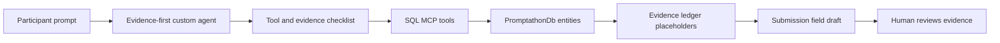

## Mission/open goal

Bonus custom agent for evidence-first SQL investigation.

Could a lightweight custom agent prompt make the promptathon workflow more reliable by forcing the agent to discover SQL MCP tools, collect evidence placeholders, run at least one vector search, and state uncertainty before drafting a submission?

This is a bonus concept draft. It is a prompt pattern and workflow sketch, not a finished custom product or deployed assistant.

## Agent and model

- Agent: GitHub Copilot Chat in agent mode with a custom evidence-first prompt
- Model: `[paste model name used]`

## Tools used with SQL MCP evidence

- `describe_entities`
  - SQL MCP evidence placeholder: paste the discovery call proving the agent did not rely on static repo files.
- `aggregate_records` on `SupportTickets`
  - SQL MCP evidence placeholder: paste grouped counts for client, category, priority, or status.
- `read_records` on `SalesOrders`
  - SQL MCP evidence placeholder: paste related order or fulfilment context if available.
- `read_records` on `SupportTickets`
  - SQL MCP evidence placeholder: paste the selected support ticket row.
- `read_records` on `SupportChats`
  - SQL MCP evidence placeholder: paste selected transcript excerpts.
- `read_records` on `Docs`
  - SQL MCP evidence placeholder: paste the source document used for vector search.
- `find_similar_docs_by_doc_id`
  - SQL MCP evidence placeholder: paste the input DocId, returned DocIds, cosine distances, and source types.

## Turn-by-turn journey

**Turn 1**

Prompt:

> You are the Zava evidence-first SQL investigator. Before answering, list the SQL MCP tools and entities you can access. Then wait until you have tool evidence before making claims. Start by discovering the schema.

Agent response, abridged:

> I found entities for products, customers, employees, sales, support, support chats, docs, and a custom similarity function. I will use SQL MCP evidence before drafting conclusions.

**Turn 2**

Prompt:

> Investigate whether B2B support issues appear connected to fulfilment context or delayed order conversations. Use aggregate queries first, then read a small number of records.

Agent response, abridged:

> I can aggregate support tickets by client, category, priority, and assigned team, then inspect related chats for delay language. I need exact rows pasted into the final issue.

**Turn 3**

Prompt:

> Read sample SupportTickets and SupportChats rows for one likely B2B issue. Create an evidence ledger with placeholders for every SQL MCP call.

Agent response, abridged:

> I selected a candidate issue, summarized the transcript, and created placeholders for ticket, chat, and aggregate evidence.

**Turn 4**

Prompt:

> Use Docs and find_similar_docs_by_doc_id for one related document. Compare similar docs, then draft the issue using only the form fields.

Agent response, abridged:

> The vector search found related documents. I drafted the submission with placeholders and a where it struggled note because the flow still needed explicit guardrails.

## Screenshots/links

- `[paste screenshot or link for schema discovery]`
- `[paste screenshot or link for evidence ledger output]`
- `[paste screenshot or link for vector comparison]`
- `[paste link to reusable custom prompt, if created]`

## Optional architecture diagram

## Outcome/value

Custom agent behavior that seemed useful:

- Forced schema discovery before analysis.
- Kept an evidence ledger so missing SQL MCP calls were visible.
- Asked for aggregation before reading individual rows.
- Required vector search even when keyword filtering looked enough.
- Added uncertainty and human review notes to the draft.

Evidence ledger placeholders:

| Step | Required evidence | Placeholder |
| --- | --- | --- |
| Discover | Entities and tools | `[paste describe_entities call]` |
| Aggregate | Support or sales grouping | `[paste aggregate_records call]` |
| Inspect | Ticket, order, or chat rows | `[paste read_records rows]` |
| Compare | Similar documents | `[paste find_similar_docs_by_doc_id output with cosine distances]` |
| Conclude | Human caveat | `[paste final uncertainty note]` |

Draft answer shape:

- Question investigated: `[paste final natural-language question]`
- SQL evidence used: `[paste call ids]`
- Tentative finding: `[paste grounded answer]`
- What is still unknown: `[paste limitations]`
- Human next step: `[paste review or escalation]`

Vector evidence:

Source document:

- `DocId`: `[paste source DocId]`
- `SourceType`: `[paste support chat or review]`
- `RelatedTicketId`: `[paste if present]`
- `RelatedOrderId`: `[paste if present]`

Similar document comparison:

| Rank | Similar DocId | Cosine distance (lower is closer) | Same issue? | Notes |
| --- | --- | --- | --- | --- |
| 1 | `[paste]` | `[paste]` | `[yes, no, or unclear]` | `[paste note]` |
| 2 | `[paste]` | `[paste]` | `[yes, no, or unclear]` | `[paste note]` |
| 3 | `[paste]` | `[paste]` | `[yes, no, or unclear]` | `[paste note]` |

Draft interpretation:

The vector search is useful as a forcing function for evidence gathering. It should not be treated as proof that fulfilment context caused the support issue unless the related rows and transcripts support that claim.

## Where the agent struggled

- The agent sometimes wanted to infer relationships that were not exposed directly by the MCP entities.
- It needed repeated reminders not to use repository files as the source of truth.
- It produced a polished recommendation too early instead of keeping the answer in draft form with unknowns.

## Bonus work

- Turn the custom prompt into a reusable Copilot instruction after testing it manually.
- Add a checklist item that rejects uncited numerical claims.
- Require the agent to label each answer as observed, inferred, or unknown.
- Keep the submission creation manual so the evidence can be reviewed first.
