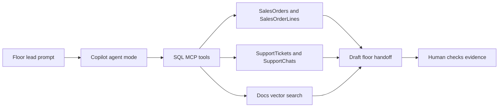

## Mission/open goal

Floor data explorer for retail and support handoff.

Could a floor lead use Copilot agent mode plus the SQL MCP tools to answer a practical shift question: "Which product areas should we watch today because sales activity and support chatter point to possible confusion or returns?"

This is a draft submission, not a polished application. The goal was to show a realistic evidence trail and the places where the agent still needed human direction.

## Agent and model

- Agent: GitHub Copilot Chat in agent mode
- Model: `[paste model name used]`

## Tools used with SQL MCP evidence

- `describe_entities`
  - SQL MCP evidence placeholder: paste the tool call showing available entities and fields.
- `aggregate_records` on `SalesOrderLines`
  - SQL MCP evidence placeholder: paste grouped totals by `ProductCategory` and `Channel`.
- `aggregate_records` on `SupportTickets`
  - SQL MCP evidence placeholder: paste grouped counts by `Category` and `Priority`.
- `read_records` on `SupportChats`
  - SQL MCP evidence placeholder: paste selected transcript rows, with sensitive details removed if needed.
- `read_records` on `Docs`
  - SQL MCP evidence placeholder: paste the selected source document row and related ids.
- `find_similar_docs_by_doc_id`
  - SQL MCP evidence placeholder: paste DocId input, returned DocIds, cosine distances, and source types.

## Turn-by-turn journey

**Turn 1**

Prompt:

> List the SQL MCP tools and database entities you can use. Do not answer from repository files. Tell me which entities look useful for sales floor and support handoff questions.

Agent response, abridged:

> I can use describe_entities, read_records, aggregate_records, and the custom vector tool. Useful entities include Products, SalesOrders, SalesOrderLines, SupportTickets, SupportChats, Docs, and find_similar_docs_by_doc_id.

**Turn 2**

Prompt:

> Aggregate recent sales order line totals by ProductCategory and Channel. Then compare that to support ticket counts by Category and Priority. Call out anything that looks worth checking, but do not overclaim causation.

Agent response, abridged:

> I found product categories with higher sales volume and separate support categories with higher ticket counts. The data suggests areas to inspect, but it does not prove the sales volume caused the support issues.

**Turn 3**

Prompt:

> Pick one support category that looks relevant to floor staff. Read a few SupportChats transcripts for that category and summarize the customer language in plain English.

Agent response, abridged:

> Several customer messages mention sizing confusion, return timing, and questions about how a product should fit. I need exact transcript excerpts pasted into the issue before this becomes durable evidence.

**Turn 4**

Prompt:

> Use the Docs table and vector similarity search for one related support or review document. Show similar documents and explain whether they reinforce or contradict the floor handoff story.

Agent response, abridged:

> Similar documents point to related fit and return concerns. I would treat this as supporting context, not a definitive trend, until the exact DocId and cosine distances are pasted into the issue.

## Screenshots/links

- `[paste screenshot or link for describe_entities output]`
- `[paste screenshot or link for aggregate_records results]`
- `[paste screenshot or link for read_records transcript evidence]`
- `[paste screenshot or link for find_similar_docs_by_doc_id output]`

## Optional architecture diagram

## Outcome/value

Draft finding:

- Product category focus: `[paste category from aggregate_records result]`
- Sales signal: `[paste line total, order count, channel split]`
- Support signal: `[paste ticket category count, priority mix, status mix]`
- Transcript signal: `[paste 2 or 3 short customer phrases from SupportChats.MessagesJson]`
- Human caveat: this is a shift handoff prompt, not an automated product quality verdict.

Evidence placeholders to add:

1. `[paste describe_entities call id and timestamp]`
2. `[paste aggregate_records result for SalesOrderLines]`
3. `[paste aggregate_records result for SupportTickets]`
4. `[paste read_records rows for SupportChats]`
5. `[paste vector output with cosine distances]`

Vector evidence:

Source document:

- `DocId`: `[paste source DocId]`
- `SourceType`: `[paste support chat or review]`
- `RelatedTicketId`: `[paste id if present]`
- `Short text excerpt`: `[paste excerpt]`

Similar documents:

| Rank | DocId | SourceType | Cosine distance (lower is closer) | Why it mattered |
| --- | --- | --- | --- | --- |
| 1 | `[paste]` | `[paste]` | `[paste]` | `[paste short reason]` |
| 2 | `[paste]` | `[paste]` | `[paste]` | `[paste short reason]` |
| 3 | `[paste]` | `[paste]` | `[paste]` | `[paste short reason]` |

Draft interpretation:

The similarity results appear useful for finding related customer language, but they should be treated as supporting evidence only. A floor lead should still verify whether the similar documents are actually about the same product, channel, and customer journey.

## Where the agent struggled

- The agent initially blended product categories from `Products` and enriched categories from `SalesOrderLines`.
- It almost overcounted sales by summing order totals after moving to line-level data.
- It summarized transcript sentiment too confidently before being asked to quote actual `MessagesJson` snippets.

## Bonus work

- Add row-level citations for every number in the summary.
- Add a small "do not use for automated decisions" note to keep the sample grounded.
- Ask the agent to separate B2C and B2B before combining any results.
