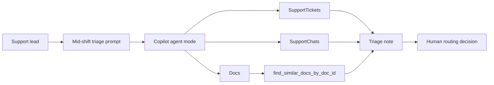

## Mission/open goal

Mid-shift support similarity triage.

Could a support lead use Copilot agent mode and SQL MCP vector search to compare a current ticket with older support chats and review documents before deciding how to route it?

This is intentionally a rough triage workflow. It is not a completed support automation app, and it leaves final routing, refund, and escalation decisions with a human.

## Agent and model

- Agent: GitHub Copilot Chat in agent mode
- Model: `[paste model name used]`

## Tools used with SQL MCP evidence

- `describe_entities`
  - SQL MCP evidence placeholder: paste the entity list and field summary.
- `aggregate_records` on `SupportTickets`
  - SQL MCP evidence placeholder: paste grouped counts by `Category`, `Priority`, and `AssignedToDisplayName`.
- `read_records` on `SupportTickets`
  - SQL MCP evidence placeholder: paste the selected ticket row.
- `read_records` on `SupportChats`
  - SQL MCP evidence placeholder: paste the selected transcript metadata and selected `MessagesJson` excerpts.
- `read_records` on `Docs`
  - SQL MCP evidence placeholder: paste the Docs row linked to the selected ticket.
- `find_similar_docs_by_doc_id`
  - SQL MCP evidence placeholder: paste the similarity tool input and returned rows with cosine distances.

## Turn-by-turn journey

**Turn 1**

Prompt:

> Discover the SQL MCP tools and entities. I want to triage support tickets using actual database calls, not repository docs.

Agent response, abridged:

> I can inspect entities, read records, aggregate records, and call a custom similarity tool. The likely flow is SupportTickets to SupportChats to Docs to find_similar_docs_by_doc_id.

**Turn 2**

Prompt:

> Show open or recently closed high priority support tickets grouped by category, assigned employee, and satisfaction score range. Keep the output small enough for a mid-shift review.

Agent response, abridged:

> The queue can be grouped by priority and category. Low satisfaction scores need separate review because they may point to completed but unhappy cases.

**Turn 3**

Prompt:

> Select one ticket from the queue, read its SupportChats transcript, and summarize what the customer wanted, what the agent promised, and what is still uncertain.

Agent response, abridged:

> The transcript includes a concrete customer request, an agent response, and some missing follow-up context. I should cite the exact transcript row before filing.

**Turn 4**

Prompt:

> Find the Docs row related to this ticket, then run the custom similarity tool. Compare similar docs with the selected ticket and call out whether each is a useful precedent or just loosely related.

Agent response, abridged:

> The vector result found related support and review documents. Some look useful as precedents, while others share vocabulary but are not the same issue.

**Turn 5**

Prompt:

> Draft a triage note that a lead could paste into a shift review. Include evidence placeholders and a section on uncertainty.

Agent response, abridged:

> Drafted a triage note with the selected ticket, similar documents, possible routing, and explicit unknowns.

## Screenshots/links

- `[paste screenshot or link for queue aggregation]`
- `[paste screenshot or link for selected SupportTickets row]`
- `[paste screenshot or link for SupportChats transcript evidence]`
- `[paste screenshot or link for Docs and vector output]`

## Optional architecture diagram

## Outcome/value

Draft triage note:

- Selected ticket: `[paste TicketId]`
- Category and priority: `[paste values]`
- Current status: `[paste status]`
- Customer ask: `[paste short quote or paraphrase with transcript row reference]`
- Agent promise: `[paste short quote or paraphrase with transcript row reference]`
- Similar precedent: `[paste DocId and summary]`
- Suggested human action: `[paste route to team, follow-up needed, or no action]`
- Uncertainty: `[paste what the data did not prove]`

Evidence placeholders to add:

1. `[paste queue aggregation call]`
2. `[paste selected SupportTickets row]`
3. `[paste SupportChats transcript excerpts]`
4. `[paste Docs source row]`
5. `[paste vector output with cosine distances]`

Vector evidence:

Source document:

- `DocId`: `[paste DocId linked to selected ticket]`
- `RelatedTicketId`: `[paste TicketId]`
- `SourceType`: `[paste value]`
- `Text excerpt`: `[paste excerpt used for comparison]`

Similarity review:

| Rank | Similar DocId | SourceType | Cosine distance (lower is closer) | Useful precedent? | Notes |
| --- | --- | --- | --- | --- | --- |
| 1 | `[paste]` | `[paste]` | `[paste]` | `[yes or no]` | `[paste why]` |
| 2 | `[paste]` | `[paste]` | `[paste]` | `[yes or no]` | `[paste why]` |
| 3 | `[paste]` | `[paste]` | `[paste]` | `[yes or no]` | `[paste why]` |

Draft interpretation:

The similarity tool helped find older cases faster than keyword filtering alone. It still needed human review because similar documents can share terms without matching the same customer problem or business rule.

## Where the agent struggled

- The agent first treated `TicketId` and `DocId` as interchangeable until prompted to look up the Docs row.
- Some vector matches were product reviews, not support chats, so they were context rather than process precedent.
- The agent drifted toward recommending refunds before the prompt clarified that only a human lead should make that decision.

## Bonus work

- Add a required "source ticket to source DocId" check so the agent does not confuse ids.
- Ask for short transcript quotes instead of long pasted chat JSON.
- Add a confidence label for each suggested precedent.
- Keep escalation recommendations separate from evidence gathering.
